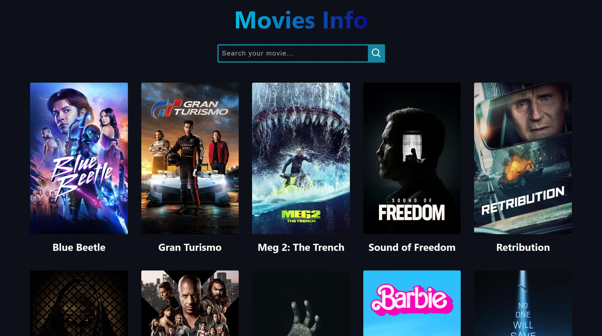
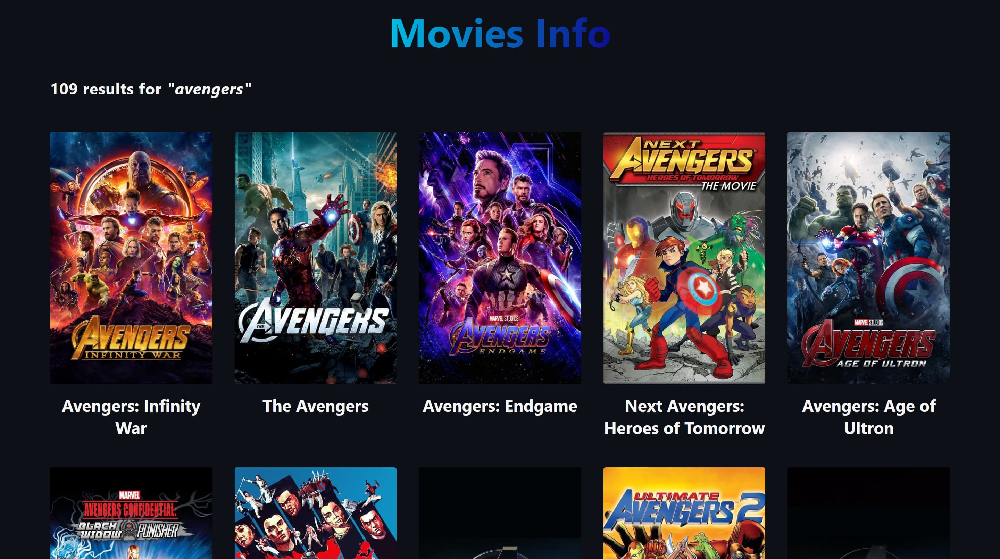
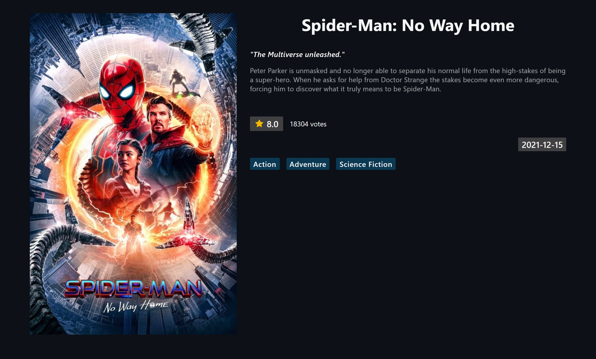
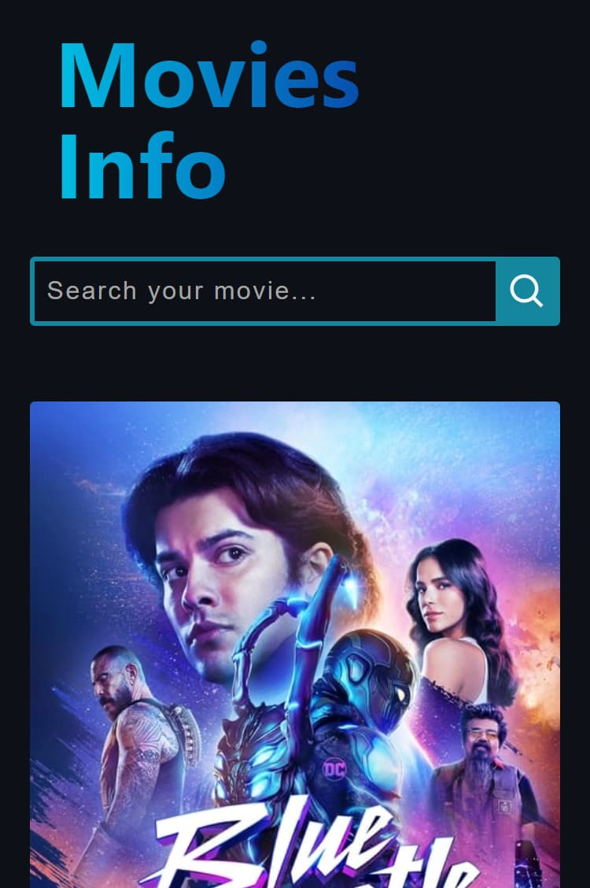
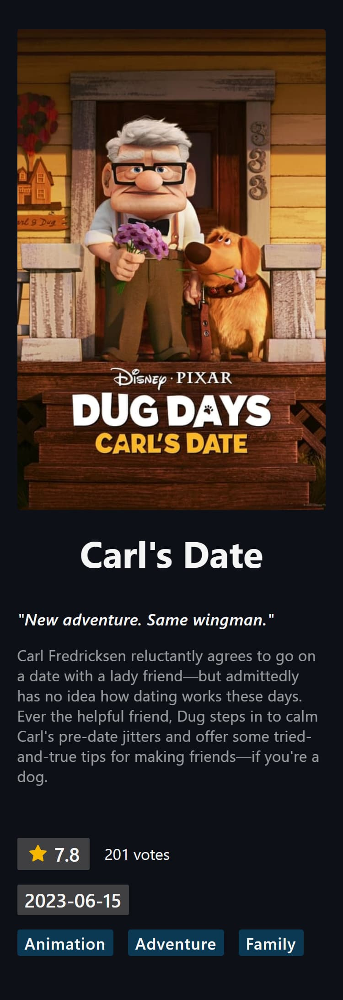

# Movies Info

Movies App is a web application built with React and TypeScript. The app consumes data from an external API to show information about movies.

Here are some of the features of the app:

- Uses React and TypeScript to build a modern and responsive UI
- Consumes data from an external API to show movie information
- Has a search bar to find movies by title
- Allows users to view movie details, including title, poster image, release date, rating, and synopsis
- Routes management with react-router-dom library

## Desktop view

- Home



- Search



- Details



## Mobile view

- Home



- Details



## Link

- [Live site](https://movies-info-six.vercel.app/)

## Built with

<p>
 <a href="https://www.typescriptlang.org/">
  
 </a>
  <a href="https://sass-lang.com/">
  
 </a>
  <a href="https://react.dev/blog/2023/03/16/introducing-react-dev">
  
 </a>
  <a href="https://vitejs.dev/">
  
 </a>
</p>

## Run the project locally

Clone the project

```bash
  git clone https://github.com/agusscript/movies-info.git
```

Go to the project directory

```bash
  cd movies-info
```

Install dependencies

```bash
  npm install
```

Start the local server

```bash
  npm run dev
```
